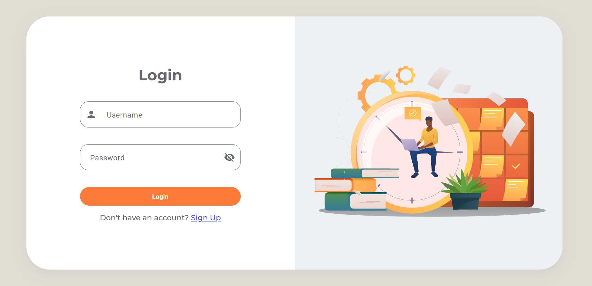
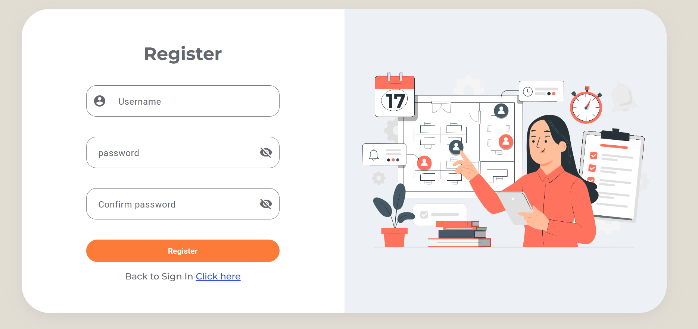
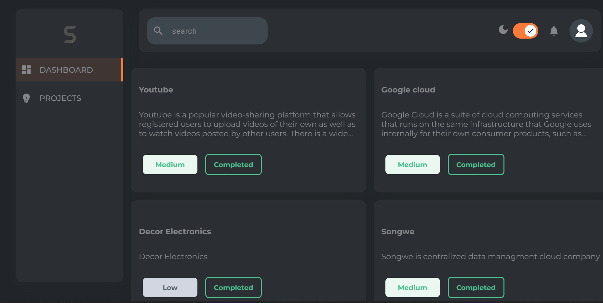
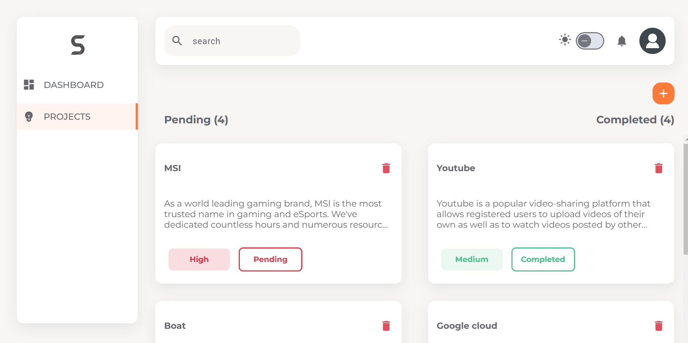
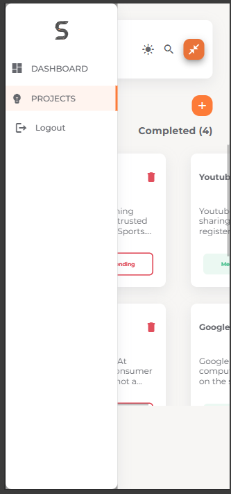

# Taskmgmt

This project was generated using [Angular CLI](https://github.com/angular/angular-cli) version 19.0.6.

## Development server

To start a local development server, run:

```bash
ng serve
```

Once the server is running, open your browser and navigate to `http://localhost:4200/`. The application will automatically reload whenever you modify any of the source files.

## About Project 

Super Tasko: Comprehensive Task Management Application

Super Tasko is a modern task management application designed to simplify workflows and improve productivity across devices. It offers a clean and user-friendly interface, with a focus on reusability, state management, and branding consistency. Below is an overview of its key features and architecture:

1. Core Features
User Authentication: Includes Login and Register pages to handle user authentication securely.
Dashboard: Provides a centralized view of user activities and task progress.
Project Management: Built using NgRx for efficient state management, ensuring seamless interactions and scalability.
Reusable Components: Input components are shared across the application, enabling consistent styling and functionality.
Dark and Light Modes: Offers both visual themes, allowing users to choose their preferred mode for better usability.
Drak & drop: offers ease of shuffling the project data from completed to pending and vice versa.

2. Design and Responsiveness
Responsive Styling with Mixins: The application leverages mixins for device-specific responsive styles, ensuring an optimal experience across mobile, tablet, and desktop devices.
Device Detection: A common service includes utility methods like isMobile, isTablet, and isDesktop to dynamically adjust templates based on the device being used.

3. Branding and Customization
Brand Identity: The logo for Super Tasko is represented by the letter "S", symbolizing simplicity and strength in task management.
Text Management: A centralized branding folder (/assets/branding/text-branding.json) houses all textual content, such as titles, paragraphs, menu lists, and other UI texts, making it easy to maintain consistency and update content.

4. Technology Stack
NgRx State Management: Ensures predictable state transitions, particularly on the project page, allowing for robust data handling and scalability.
Shared Module: Facilitates the reuse of UI components, reducing code duplication and improving maintainability.
Dark/Light Mode Switching: Implements a smooth toggle between themes for better visual accessibility.

5. Scalability and Maintainability
Reusability: Shared input components and centralized text management ensure efficient code reuse and consistent design.
Dynamic Templates: Device-specific utilities enable conditional rendering, optimizing the user experience across devices.
Conclusion
Super Tasko is a thoughtfully designed application that combines state-of-the-art technology, reusability, and branding consistency. With features like responsive design, reusable inputs, centralized text management, and dynamic device handling, it is an ideal solution for task management in diverse environments.

This professional structure highlights the thoughtfulness and engineering excellence behind your project, emphasizing its usability, scalability, and user-centric design.









